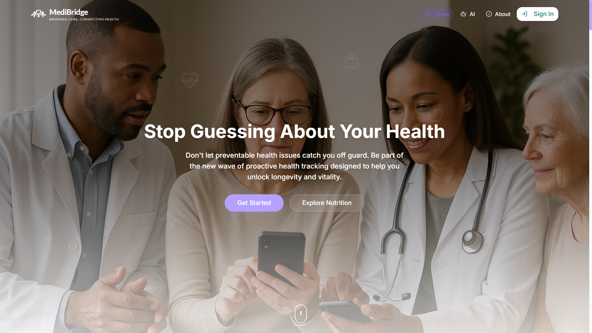
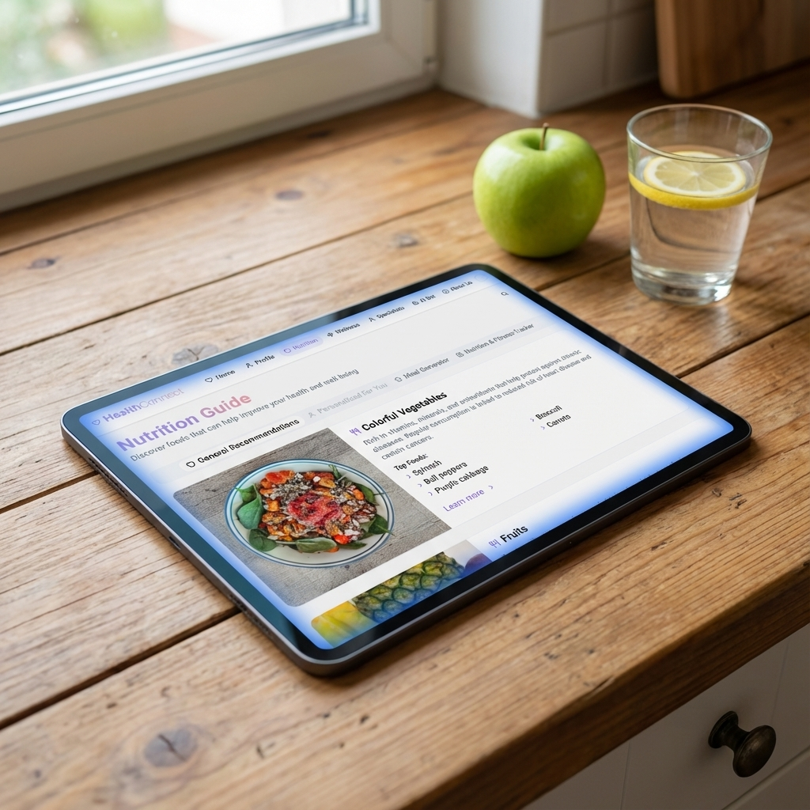
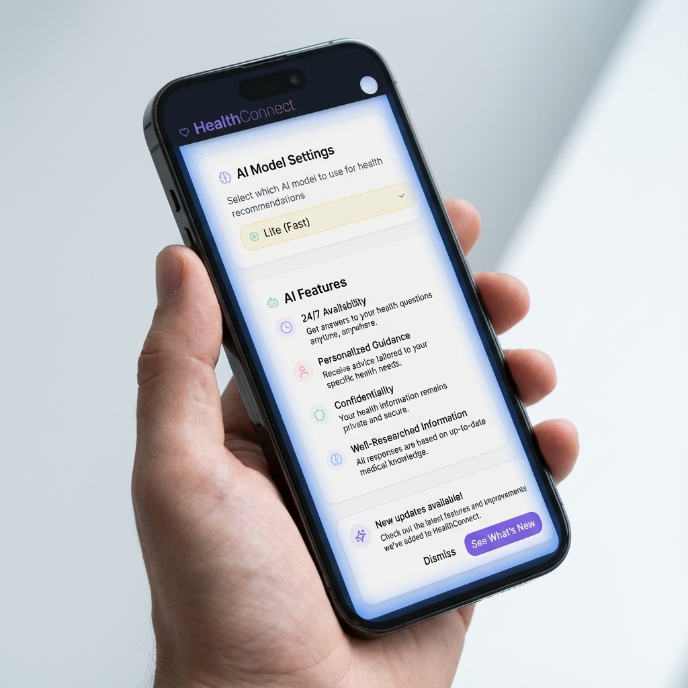

# 🩺 MediBridge — AI-Powered Health & Wellness Platform

**MediBridge** is a unified, AI-powered health ecosystem designed to help you take control of your holistic well-being.

🔗 **Try it now:** [medibridge.qzz.io](https://medibridge.qzz.io)

---

## ✨ Key Features

| Feature | Description |
|---|---|
| 🤖 **AI Health Assistant** | Specialized symptom evaluation with bleeding-edge AI models |
| 🥗 **Nutrition ScanBar** | Scan food barcodes for instant nutritional breakdowns and AI dietary verdicts |
| 🧠 **Mental Wellness Journal** | Daily mood tracking with interactive visualizations and AI emotional analysis |
| 👨‍⚕️ **Doctor Consultations** | Browse verified practitioners and book telemedicine sessions |
| 📊 **Health Reports** | Comprehensive analysis with cross-device sync |
| 🛡️ **Enterprise Security** | HttpOnly cookies, JWT sessions, encrypted data storage |

---

## 📸 Screenshots

| Dashboard | Nutrition Analysis |
|---|---|
|  |  |

| AI Chat | Health Reports |
|---|---|
|  |  |

---

## 💳 Pricing

| | Free | Lite (Starts from ₹49) | Pro (Starts from ₹149) |
|---|---|---|---|
| AI Health Assistant | ✅ Basic | ✅ Advanced | ✅ Bleeding-Edge |
| Health Reports | ✅ | ✅ Advanced | ✅ Unlimited |
| Nutrition ScanBar | ❌ | ✅ | ✅ |
| Invisible AI | ❌ | ❌ | ✅ |

---

## 🔒 License & Usage Rights

**This project is protected by a PROPRIETARY LICENSE AGREEMENT.**

> ⚠️ The source code, design assets, and intellectual property of MediBridge are the exclusive property of **Priyangshu Dutta** and **The Alpha Group**. Unauthorized use is strictly prohibited.

---

© 2024–2026 Priyangshu Dutta. All rights reserved.
